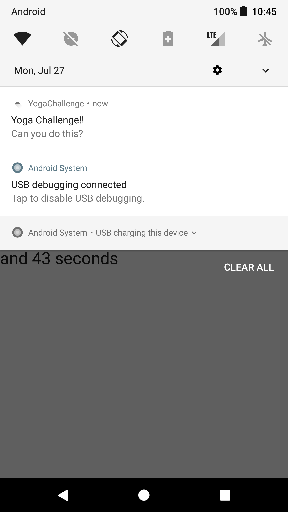

# YogaChallenge
Android application that uses alarm manager to allow users to set a time for user to get random yoga pose challenges sent to them.

## Tech-stack used:

  - Kotlin
  - Coroutine
  - Retrofit 2
  - Alarm manager
  - Broadcast Receiver
  - Countdown timer
  - Shared Preferences 
  - Glide (library)
  - View Model
  - MutableLivedata

## Screeshots: 

    

